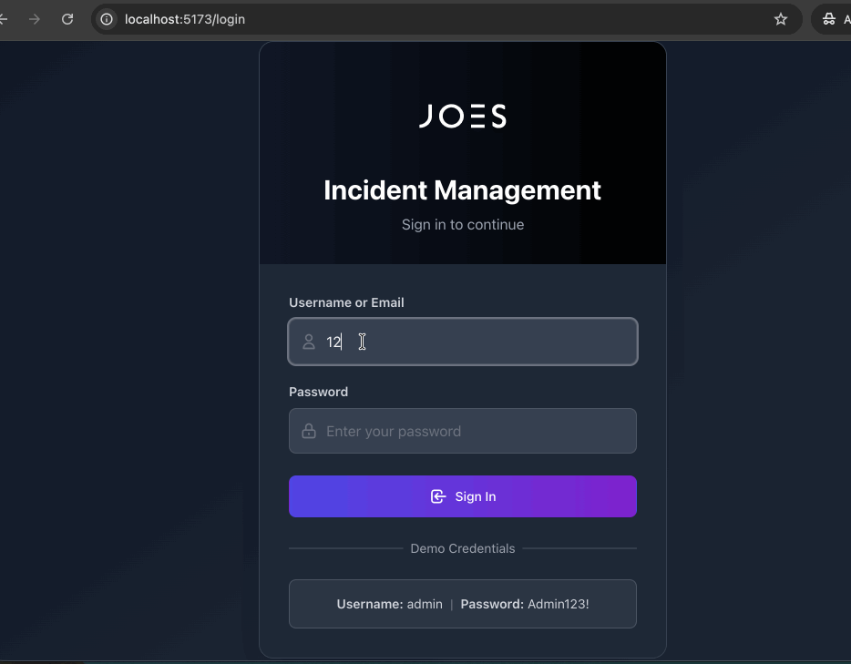
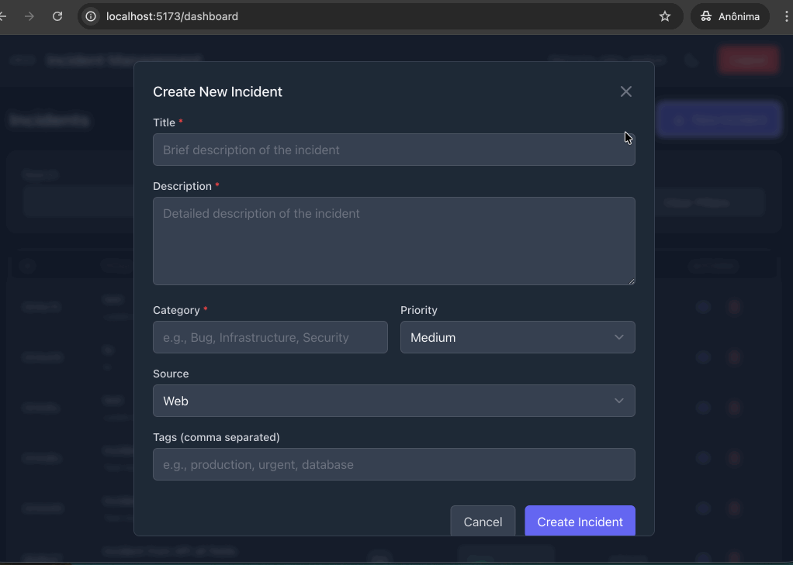
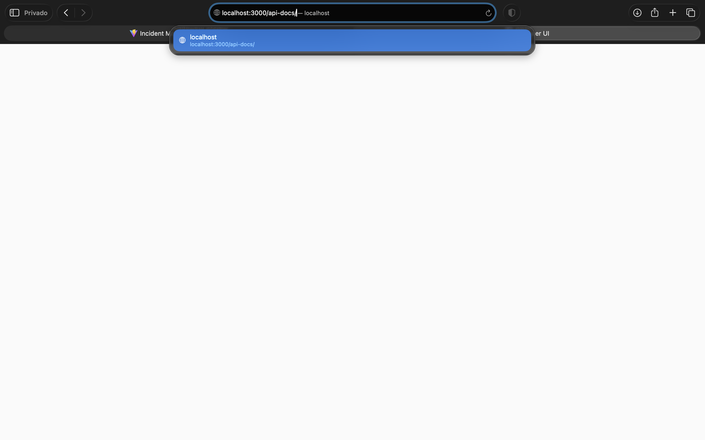
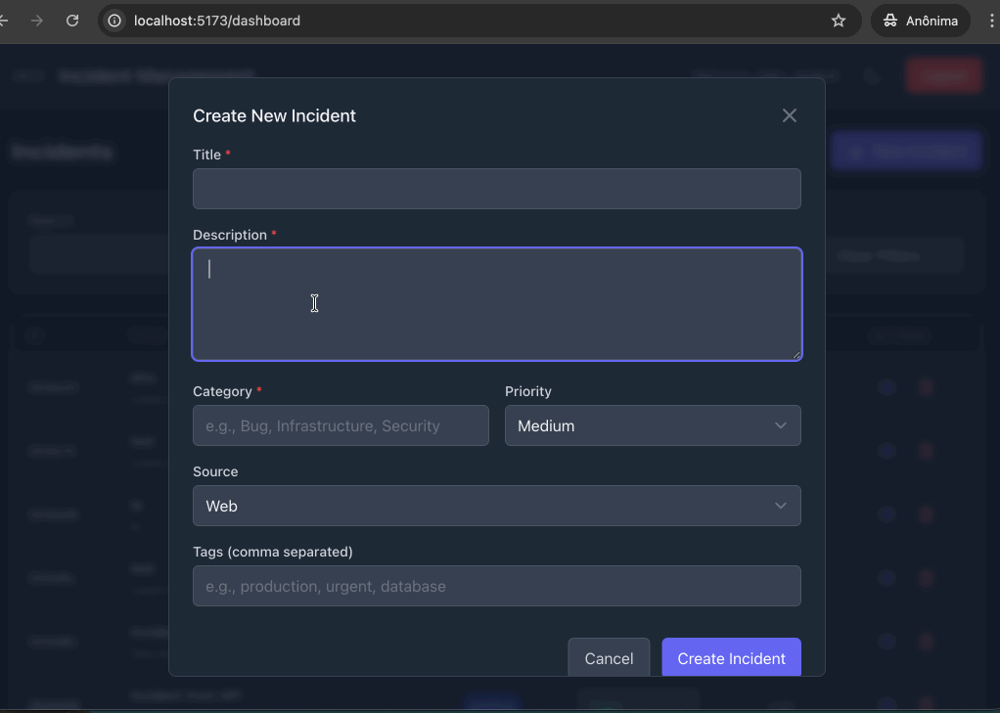
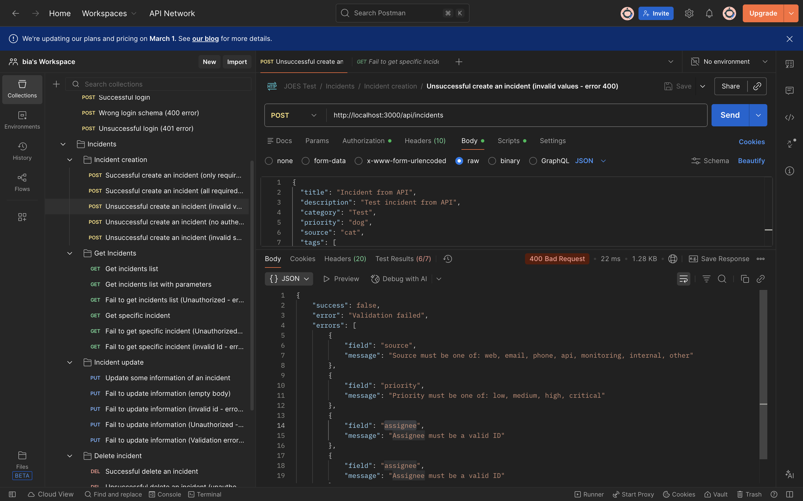

{\rtf1\ansi\ansicpg1252\cocoartf2867
\cocoatextscaling0\cocoaplatform0{\fonttbl\f0\fswiss\fcharset0 Helvetica;}
{\colortbl;\red255\green255\blue255;}
{\*\expandedcolortbl;;}
\paperw11900\paperh16840\margl1440\margr1440\vieww28600\viewh18000\viewkind0
\pard\tx720\tx1440\tx2160\tx2880\tx3600\tx4320\tx5040\tx5760\tx6480\tx7200\tx7920\tx8640\pardirnatural\partightenfactor0

\f0\fs24 \cf0 # Bug Report: Incident Management System\
**Date:** February 2, 2026\
**Reporter:** QA Team\
**Status:** Open\
\
---\
\
## \uc0\u55357 \u57056  Global Environment Details\
* **Operating System:** macOS Sonoma 14.2\
* **Browsers:** Chrome v121.0.6167.85 / Safari v17.2\
* **Environment:** Localhost / Development (`http://localhost:3000`)\
* **API Version:** v1.0\
\
---\
\
## \uc0\u55357 \u56350  Bug 1: Stack trace exposed internal server directory structure\
* **Feature:** API Service\
* **Bug Type:** Security Bug\
* **Priority:** \uc0\u55357 \u56628  Critical\
* **Description:** Every request returning a 404 error includes stack information that exposes the internal server directory structure.\
* **Steps to Reproduce:**\
    1. Open terminal or Postman.\
    2. Send GET: `curl -X 'GET' 'http://localhost:3000/api/incidents/697eacac12f8c6be5200458t' -H 'accept: application/json' -H 'Authorization: Bearer <Token>'`\
    3. Inspect the JSON response body.\
* **Actual Result:** Response includes a full stack trace revealing internal server paths.\
* **Expected Result:** The API should return a generic 404 error without internal directory details.\
\pard\tx720\tx1440\tx2160\tx2880\tx3600\tx4320\tx5040\tx5760\tx6480\tx7200\tx7920\tx8640\pardirnatural\partightenfactor0
\cf0 * **Evidence:** \
\pard\tx720\tx1440\tx2160\tx2880\tx3600\tx4320\tx5040\tx5760\tx6480\tx7200\tx7920\tx8640\pardirnatural\partightenfactor0
\cf0 \
---\
\
## \uc0\u55357 \u56350  Bug 2: Login form missing error message for specific character lengths\
* **Feature:** Authentication\
* **Bug Type:** UI/UX (Usability)\
* **Priority:** \uc0\u55357 \u56629  Low\
* **Description:** Submitting strings of 6+ characters results in a page refresh with no error feedback.\
* **Steps to Reproduce:**\
    1. Navigate to the login page.\
    2. Input 6+ characters into the Username and Password fields.\
    3. Click Submit.\
* **Actual Result:** Fields are cleared and page reloads, but no error message is displayed.\
* **Expected Result:** Error message should display "Invalid credentials" or similar, and fields should retain input.\
\pard\tx720\tx1440\tx2160\tx2880\tx3600\tx4320\tx5040\tx5760\tx6480\tx7200\tx7920\tx8640\pardirnatural\partightenfactor0
\cf0 * **Evidence:** \
\pard\tx720\tx1440\tx2160\tx2880\tx3600\tx4320\tx5040\tx5760\tx6480\tx7200\tx7920\tx8640\pardirnatural\partightenfactor0
\cf0 \
---\
\
## \uc0\u55357 \u56350  Bug 3: No error message when Title exceeds max character limit\
* **Feature:** Incident Creation\
* **Bug Type:** UI/UX (Usability)\
* **Priority:** \uc0\u55357 \u57312  Medium\
* **Description:** The Title field lacks validation feedback when character limits are exceeded.\
* **Steps to Reproduce:**\
    1. Click \'93+ Add incident.\'94\
    2. Input a string > 500 characters into the Title field.\
    3. Fill required fields and click Submit.\
* **Actual Result:** Submit button disables, no incident is created, and no error message appears.\
* **Expected Result:** System should display a validation message: "Title exceeds maximum character limit."\
\pard\tx720\tx1440\tx2160\tx2880\tx3600\tx4320\tx5040\tx5760\tx6480\tx7200\tx7920\tx8640\pardirnatural\partightenfactor0
\cf0 * **Evidence:** \
\pard\tx720\tx1440\tx2160\tx2880\tx3600\tx4320\tx5040\tx5760\tx6480\tx7200\tx7920\tx8640\pardirnatural\partightenfactor0
\cf0 \
---\
\
## \uc0\u55357 \u56350  Bug 4: Swagger UI page fails to load on Safari\
* **Feature:** Swagger UI\
* **Bug Type:** Functional Bug\
* **Priority:** \uc0\u55357 \u56628  High\
* **Description:** The documentation page remains blank on Safari browser.\
* **Steps to Reproduce:**\
    1. Open Safari (v17.2).\
    2. Go to `http://localhost:3000/api-docs/`.\
* **Actual Result:** An empty white page is displayed.\
* **Expected Result:** Swagger UI should render with all API documentation visible.\
\pard\tx720\tx1440\tx2160\tx2880\tx3600\tx4320\tx5040\tx5760\tx6480\tx7200\tx7920\tx8640\pardirnatural\partightenfactor0
\cf0 * **Evidence:** \
\pard\tx720\tx1440\tx2160\tx2880\tx3600\tx4320\tx5040\tx5760\tx6480\tx7200\tx7920\tx8640\pardirnatural\partightenfactor0
\cf0 \
---\
\
## \uc0\u55357 \u56350  Bug 5: Submission with white space in required fields results in silent failure\
* **Feature:** Incident Creation\
* **Bug Type:** Functional Test\
* **Priority:** \uc0\u55357 \u56629  Low\
* **Description:** Using "spaces" as values bypasses front-end empty-checks but fails to provide a backend error message.\
* **Steps to Reproduce:**\
    1. Open "+ Add incident" form.\
    2. Type a single space (" ") in all required fields.\
    3. Click Submit.\
* **Actual Result:** Page stops responding/button disables with no error message.\
* **Expected Result:** Validation should trigger: "Required fields cannot be empty or contain only spaces."\
\pard\tx720\tx1440\tx2160\tx2880\tx3600\tx4320\tx5040\tx5760\tx6480\tx7200\tx7920\tx8640\pardirnatural\partightenfactor0
\cf0 * **Evidence:** \
\pard\tx720\tx1440\tx2160\tx2880\tx3600\tx4320\tx5040\tx5760\tx6480\tx7200\tx7920\tx8640\pardirnatural\partightenfactor0
\cf0 \
---\
\
## \uc0\u55357 \u56350  Bug 6: Duplicate error message in 400 Bad Request (Assignee)\
* **Feature:** API Service\
* **Bug Type:** Functional Bug\
* **Priority:** \uc0\u55357 \u57312  Medium\
* **Description:** The API returns the same error string twice when the assignee is invalid.\
* **Steps to Reproduce:**\
    1. Send a POST request to `/api/incidents` with an invalid assignee string.\
    2. View the 400 Bad Request response body.\
* **Actual Result:** The assignee error message appears twice in the response payload.\
* **Expected Result:** Each validation error should appear only once.\
\pard\tx720\tx1440\tx2160\tx2880\tx3600\tx4320\tx5040\tx5760\tx6480\tx7200\tx7920\tx8640\pardirnatural\partightenfactor0
\cf0 * **Evidence:** }